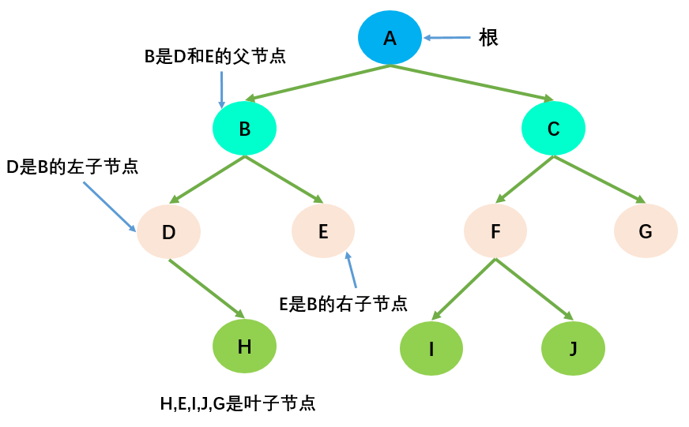

# 树

## 树的概念

- 树：只有一个根节点，分叉出许多级树枝，最后是叶子；
- 节点的度（Degree）：节点的子树个数，比如节点B的度为2；
- 树的度：树的所有节点中最大的度数，如上图树的度为2；
- 叶节点（Leaf）：度为0的节点（也称为叶子节点），如上图的H，I等；
- 父节点（Parent）：度不为0的节点称为父节点，如上图节点B是节点D和E的父节点；
- 子节点（Child）：若B是D的父节点，那么D就是B的子节点；
- 兄弟节点（Sibling）：具有同一父节点的各节点彼此是兄弟节点，比如上图的B和C，D和E互为兄弟节点；
- 路径和路径长度：路径指的是一个节点到另一节点的通道，路径所包含边的个数称为路径长度，比如A->H的路径长度为3；
- 节点的层次（Level）：规定根节点在1层，其他任一节点的层数是其父节点的层数加1。如B和C节点的层次为2；
- 树的深度（Depth）：树种所有节点中的最大层次是这棵树的深度，如上图树的深度为4；

## 二叉树
如果树中的每一个节点最多只能由两个子节点，这样的树就称为二叉树；几乎所有树都可以表示成二叉树形式

### 二叉树特性
- 一个二叉树的第 i 层的最大节点树为：2(i-1)，i >= 1；
- 深度为k的二叉树的最大节点总数为：2k - 1 ，k >= 1；
- 对任何非空二叉树，若 n0 表示叶子节点的个数，n2表示度为2的非叶子节点个数，那么两者满足关系：n0 = n2 + 1；如下图所示：H，E，I，J，G为叶子节点，总数为5；A，B，C，F为度为2的非叶子节点，总数为4；满足n0 = n2 + 1的规律。

### 二叉搜索树
二叉搜索树的特点主要是较小的值总是保存在左节点上，相对较大的值总是保存在右节点上。这种特点使得二叉搜索树的查询效率非常高，这也就是二叉搜索树中"搜索"的来源。
- 条件1：非空左子树的所有键值小于其根节点的键值。比如三中节点6的所有非空左子树的键值都小于6；
- 条件2：非空右子树的所有键值大于其根节点的键值；比如三中节点6的所有非空右子树的键值都大于6；
- 条件3：左、右子树本身也都是二叉搜索树；
